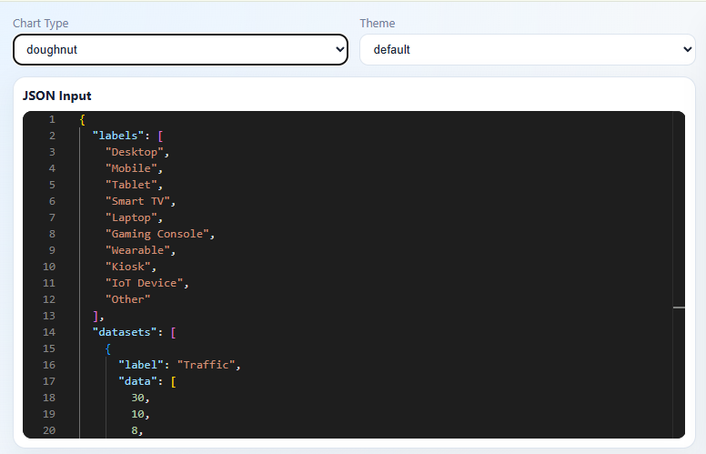
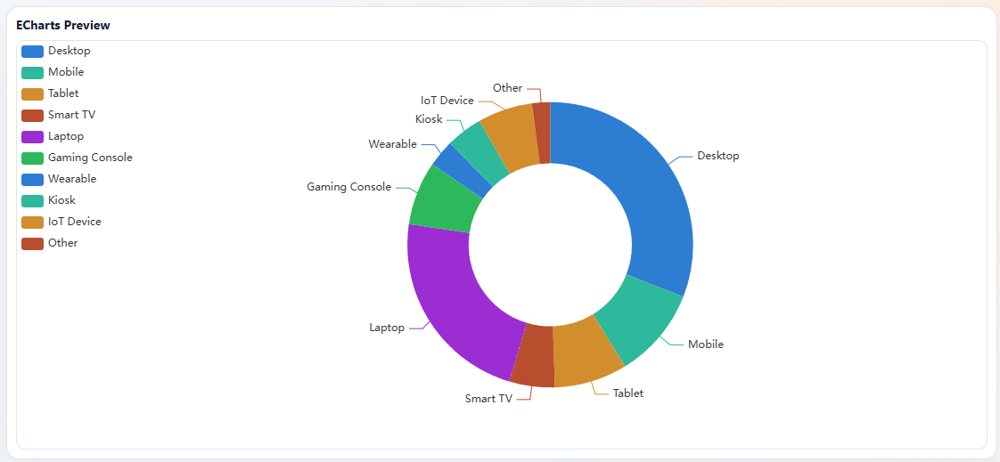
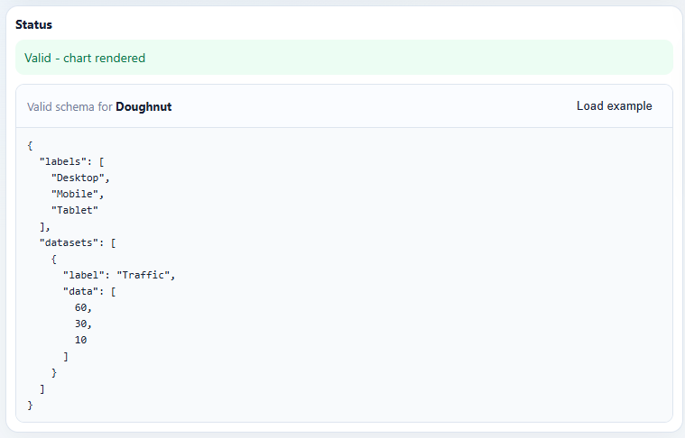

# JSON Viz Studio

**A JSON-first chart builder with strict validation, AI repair, live ECharts rendering, and optional AI-generated full HTML output.**

Create beautiful, interactive charts by simply pasting JSON. Validate your data, automatically fix common schema errors with AI, and render charts instantly—all in one powerful, easy-to-use studio.

---

## ✨ Features

- **JSON-First Workflow** — Paste chart JSON directly into the editor; no complex UI to learn
- **Real-Time Validation** — Instant feedback on schema compliance with actionable error messages
- **AI-Powered Repair** — Automatically fix invalid JSON schemas using an LLM (opt-in)
- **Live Preview** — See your chart rendered instantly using Apache ECharts
- **AI-Generated HTML** — Generate complete, self-contained HTML files with a single click
- **Multiple Chart Types** — Support for bar, line, area, pie, doughnut, and scatter charts
- **Theme Support** — Pick from multiple themes to customize your chart appearance
- **Sandboxed Output** — Generated HTML is safely isolated in a sandboxed iframe

---

## 🎬 Workflow Overview

### 1. Input Your JSON
Select a chart type and paste your JSON data into the Monaco Editor:



### 2. Live Chart Preview
Your chart renders instantly as Apache ECharts:



### 3. Validation Status
Clear status indicators show validation state and available actions:



---

## 🚀 Quick Start

### Prerequisites
- Python 3.12+
- Node.js 20+
- Docker (optional)

### Local Development

**Backend:**
```bash
cd backend
pip install -r requirements.txt
uvicorn app.main:app --reload --port 8000
```

**Frontend:**
```bash
cd frontend
npm install
npm run dev
```

Then visit:
- Frontend: `http://localhost:5173`
- Backend: `http://localhost:8000`

### Docker Compose

```bash
docker compose up --build
```

Exposes:
- Frontend: `http://localhost:5173`
- Backend: `http://localhost:8000`

---

## ⚙️ Configuration

1. Copy `.env.example` to `.env`
2. Fill in your LLM API credentials (Kimi/Moonshot AI by default)

Key environment variables:
| Variable | Purpose |
|----------|---------|
| `KIMI_API_KEY` | Kimi API key |
| `LLM_MODEL_KIMI` | Model name (default: `kimi-k2.6`) |
| `KIMI_BASE_URL` | API endpoint (default: `https://api.moonshot.ai/v1`) |
| `CORS_ORIGINS` | Allowed frontend origins |
| `VITE_API_BASE_URL` | Backend URL for frontend (build-time variable) |

---

## 📚 Supported Chart Types

| Type | Description | Data Format |
|------|-------------|-------------|
| **bar** | Vertical bar chart | `{ labels, datasets }` |
| **line** | Line chart with optional fill | `{ labels, datasets }` |
| **area** | Area chart with stacked series | `{ labels, datasets }` |
| **pie** | Pie chart (single dataset) | `{ labels, datasets[0] }` |
| **doughnut** | Doughnut chart (single dataset) | `{ labels, datasets[0] }` |
| **scatter** | Scatter plot | `{ datasets: [{ data: [{x, y}] }] }` |

---

## 🔌 API Reference

All endpoints return error responses in the format: `{ "code": "STRING", "message": "Description" }`

| Method | Endpoint | Purpose |
|--------|----------|---------|
| `GET` | `/health` | Health check |
| `POST` | `/api/validate` | Validate and normalize chart JSON |
| `POST` | `/api/repair` | Fix invalid schema using LLM |
| `POST` | `/api/generate-code` | Generate self-contained HTML chart |

**Example Request:**
```bash
curl -X POST http://localhost:8000/api/validate \
  -H "Content-Type: application/json" \
  -d '{
    "chartType": "bar",
    "data": {
      "labels": ["Q1", "Q2", "Q3"],
      "datasets": [{"label": "Sales", "data": [100, 200, 150]}]
    }
  }'
```

---

## 🧪 Testing

### Backend Tests
```bash
cd backend
pytest
```

### Frontend Tests
```bash
cd frontend
npm test
```

### Manual E2E Verification
1. Start both backend and frontend services
2. Paste valid chart JSON and confirm rendering
3. Introduce validation errors and test repair with AI
4. Generate AI-powered HTML and verify sandbox isolation

---

## 📁 Project Structure

```
.
├── backend/                    # FastAPI service
│   ├── app/
│   │   ├── main.py            # FastAPI app, CORS, routes
│   │   ├── api/               # Route handlers
│   │   ├── schemas/           # Pydantic models
│   │   ├── services/          # Business logic & LLM client
│   │   └── prompts/           # LLM prompt templates
│   └── tests/                 # Pytest suite
│
├── frontend/                   # Vite + React SPA
│   ├── src/
│   │   ├── components/        # React components
│   │   ├── hooks/             # Custom hooks
│   │   ├── store/             # Zustand state
│   │   ├── services/          # API client
│   │   └── utils/             # Chart builders & helpers
│   └── dist/                  # Build output
│
├── imgs/                      # UI screenshots
├── docker-compose.yml         # Local containerization
├── AGENTS.md                  # Detailed architecture & conventions
└── README.md                  # This file
```

---

## 🏗️ Architecture

**Frontend (Vite + React + TypeScript)**
- Monaco Editor for JSON input
- Apache ECharts for live preview
- Zustand for state management
- Responsive UI with CSS custom properties

**Backend (FastAPI + Pydantic)**
- Strict schema validation
- Optional LLM-based repair with Kimi
- Sandboxed HTML generation
- Comprehensive error handling

For in-depth architecture details, build commands, development conventions, and deployment notes, see [AGENTS.md](AGENTS.md).

---

## 🔐 Security

- LLM-generated HTML is **sandboxed** in an iframe with restricted permissions
- Light regex-based sanitization blocks unsafe patterns
- No authentication layer (add before exposing to untrusted networks)
- API keys stored in environment variables only
- CORS is configurable and should be kept restrictive

**⚠️ Note:** Sandbox is the primary security control. See [AGENTS.md](AGENTS.md#security-considerations) for details.

---

## 🤝 Contributing

When modifying the codebase:
- **Backend:** Keep route handlers thin; put logic in `services/`. Use type hints and structured logging.
- **Frontend:** Use functional components, Zustand selectors, and tree-shaken ECharts imports.
- **Configuration:** Update `.env.example`, `docker-compose.yml`, and [AGENTS.md](AGENTS.md) if config changes.
- **New Chart Types:** Follow the task guide in [AGENTS.md#add-a-new-supported-chart-type](AGENTS.md).

---

## 📖 Documentation

- **[AGENTS.md](AGENTS.md)** — Complete architecture, API schemas, development conventions, testing instructions, and common tasks
- **[backend/README.md](backend)** — Backend implementation details (if available)
- **[frontend/README.md](frontend)** — Frontend implementation details (if available)

---

## 📄 License

...

---

## 🙋 Support & Feedback

For issues, feature requests, or questions, please refer to [AGENTS.md](AGENTS.md) for technical details and architecture overview.
